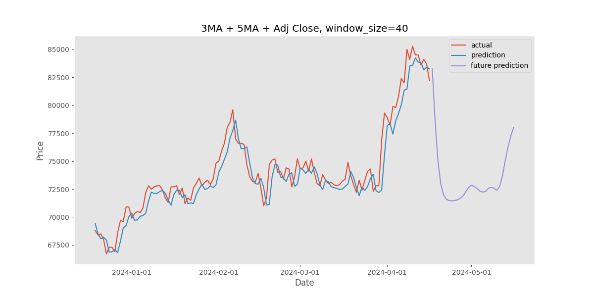
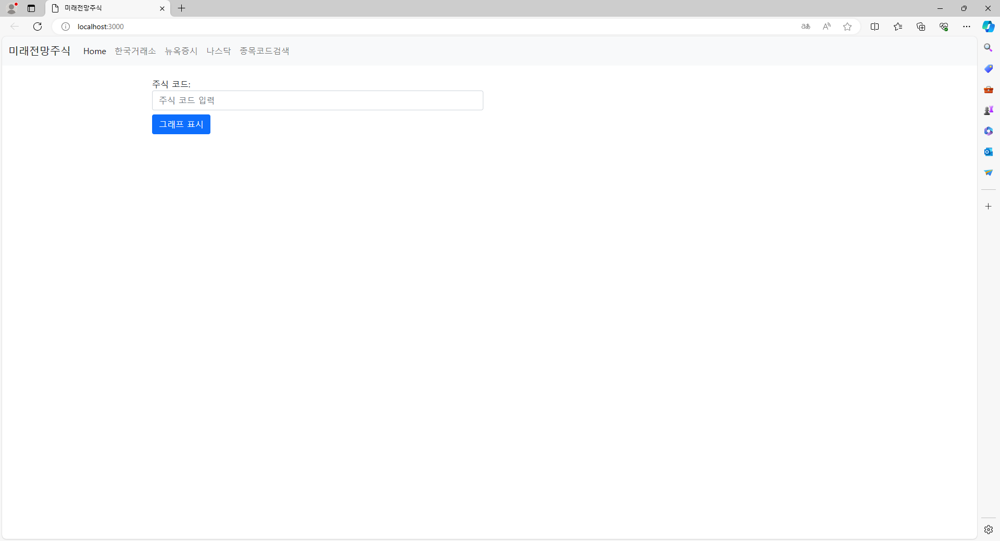

이 파일은 우송대 2024 1학기 캡스톤 디자인 과제입니다.

## 목차
  - [개요](#개요)

## 개요
- 프로젝트 이름: LSTM 모델을 이용한 주식 예측 프로그램
- 프로젝트 제작 기간: 2024.03.08 ~ 현재 진행형
- 개발 언어: python, javascript, HTML, CSS
- 개발 엔진: vscode, node.js
- 팀 멤버: 길석종, 이창민

- ## 프로젝트 설명
|||
|:---:|:---:|
|메인 홈페이지|애플주식 예측|
